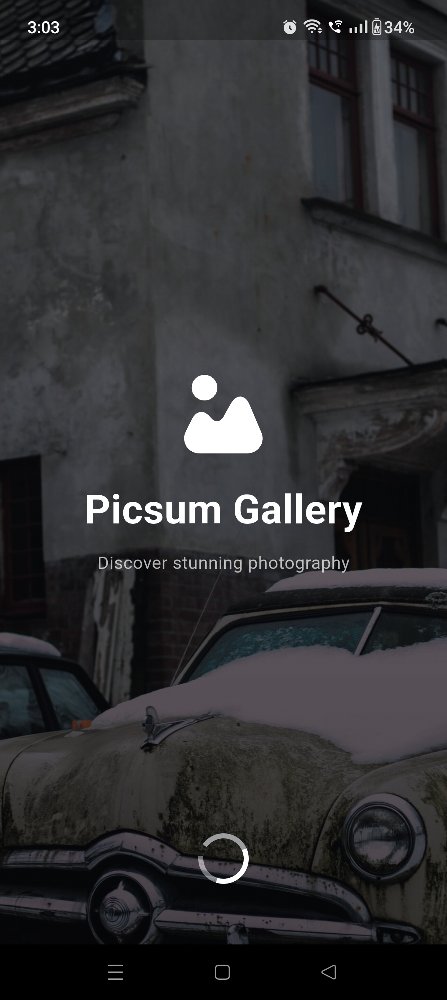
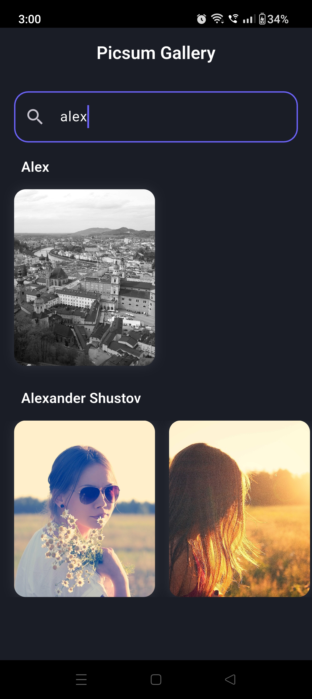
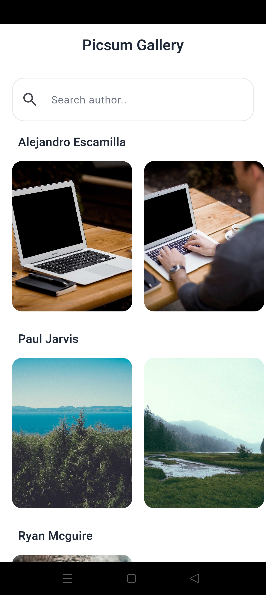

# Picsum Gallery

A modern Flutter gallery application built using Clean Architecture, BLoC State Management, and Material 3 design.

The application fetches images from the Picsum API and presents them in an organized gallery grouped by author.

---

## Screenshots

### Image Details


### Splash Screen



### Gallery Screen



### Gallery Screen 2



---

### Core Features

✅ Fetch photos from Picsum API

✅ Clean Architecture

✅ BLoC State Management

✅ Repository Pattern

✅ Dependency Injection

✅ Material 3 UI

✅ Group photos by author

✅ Horizontal image galleries

✅ Search photos by author

✅ Pull to refresh

✅ Infinite scrolling pagination

✅ Hero image animations

✅ Full-screen image preview

✅ Cached network images

✅ Shimmer loading placeholders

✅ Dark Mode support

---

## Architecture

This project follows Clean Architecture principles.

```
lib/
├── core/
│   ├── common/
│   ├── theme/
│   └── widgets/
│
├── features/
│   ├── splash/
│   │
│   └── gallery/
│       ├── data/
│       │   ├── datasources/
│       │   ├── models/
│       │   └── repositories/
│       │
│       ├── domain/
│       │   └── repository/
│       │
│       └── presentation/
│           ├── bloc/
│           ├── pages/
│           └── widgets/
│
└── init_dependencies.dart
```

---

## State Management

The application uses:

- flutter_bloc
- Equatable

State Flow:

```
UI
 ↓
Bloc Event
 ↓
Repository
 ↓
Remote Data Source
 ↓
API
```

---

## API

Data is fetched from:

https://picsum.photos/v2/list

Example Response:

```json
{
  "id": "0",
  "author": "Alejandro Escamilla",
  "download_url": "..."
}
```

---

## Packages Used

| Package              | Purpose              |
| -------------------- | -------------------- |
| flutter_bloc         | State Management     |
| equatable            | Value Equality       |
| http                 | API Requests         |
| cached_network_image | Image Caching        |
| shimmer              | Loading Skeletons    |
| get_it               | Dependency Injection |

---

## Getting Started

### Clone Repository

```bash
git clone https://github.com/sreeragcr7/picsum-gallery.git
```

### Install Packages

```bash
flutter pub get
```

### Run Application

```bash
flutter run
```

---

## Performance Optimizations

- Image caching using CachedNetworkImage
- Lazy loading pagination
- Efficient BLoC state updates
- Reusable widgets
- Clean separation of concerns

---

## Future Improvements

- Favorite Images
- Offline Support
- Local Database (Hive)
- Debounced Search
- SliverAppBar
- Grid/List View Toggle
- Image Download Support

---

## Author

Sreerag

Built as part of an Intern Selection Task using Flutter.
